# Reproducing the TaxiVis Paper Figures

The figures in the TVCG 2014 paper (*Visual Exploration of Big Spatio-Temporal
Urban Data: A Study of New York City Taxi Trips*) were made with 2011 and 2012
data. This page shows how far the current Qt5 build gets with the January 2013
TLC data (14.8 million trips), using only the interactive interface. Every image
below is an unedited window capture.

## Taxis as sensors: hourly point clouds (paper Fig. 2)

Pickups (blue) and dropoffs (orange) in Manhattan on Wednesday 2013-01-02, one
hour per panel. Zoom level 12, level-of-detail thinning off (key L) so every
trip is drawn.

| 7 to 8 AM | 8 to 9 AM | 9 to 10 AM | 10 to 11 AM |
|---|---|---|---|
| 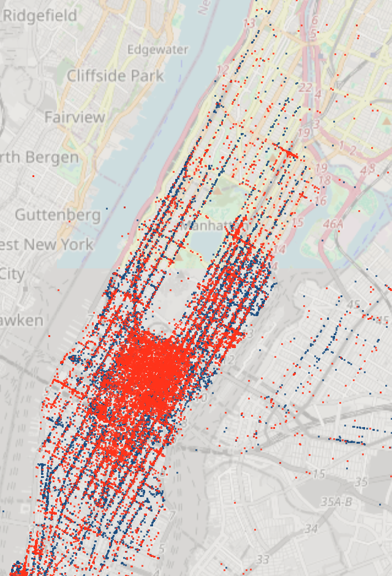 | 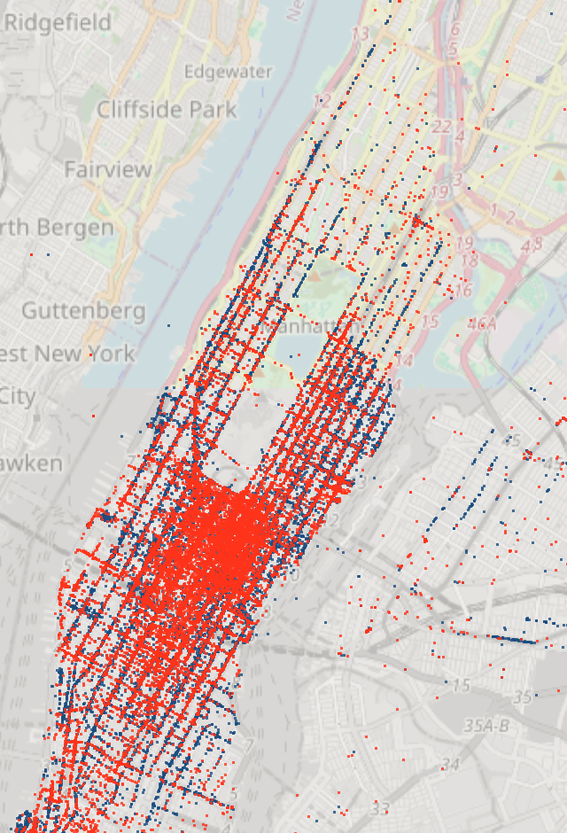 | 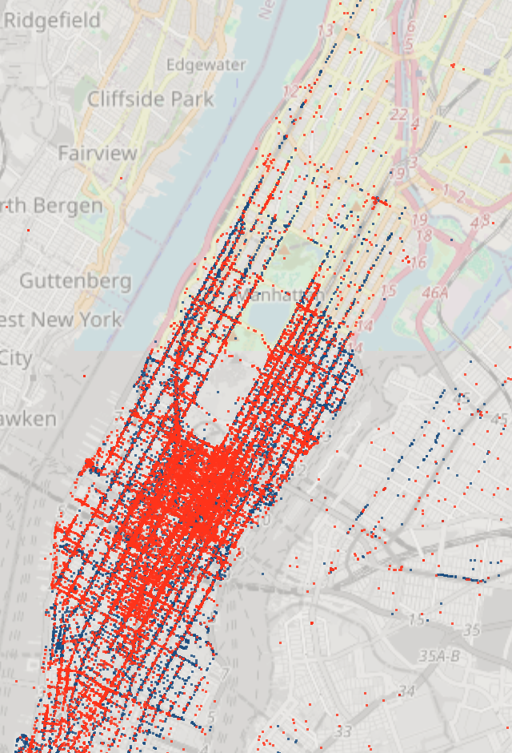 | 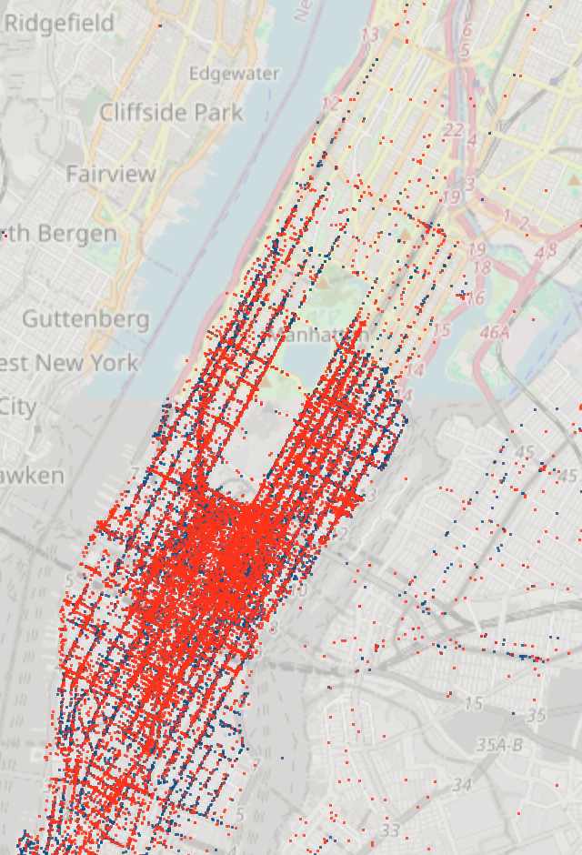 |

How: set Start to 01/02/13 07:00 and End to 08:00 with step 1 hour, click
Query, then press the step-forward button three times, capturing each time.
Panels are crops of the map area.

## Neighborhood comparison over a week (paper Fig. 8)

Four pickup regions, drawn as polygons, compared over the week of
2013-01-01 to 2013-01-08 with 168 hourly bins. Red is Lower Manhattan, green
Midtown, orange the Upper East Side, blue Harlem and upper Manhattan.

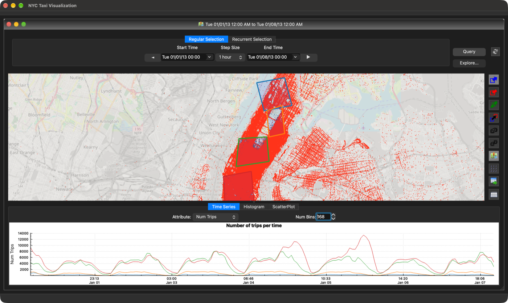

The same pattern as in the paper appears: Midtown and Lower Manhattan dominate
on weekdays, Lower Manhattan surges on the Friday and Saturday nights of
January 4 and 5, and the two uptown regions stay an order of magnitude lower.
The regions are approximate, drawn freehand at zoom 12 where Manhattan is
about 150 points wide.

How: choose the pickup type, Option + right-click to place polygon vertices,
close each polygon on its first vertex. Set End to 01/08/13 00:00 and Start
to 01/01/13 00:00 (End first, because the app validates on every edit), click
Query, and set Num Bins to 168 in the Time Series tab.

## Trips from Lower Manhattan to the airports (paper Fig. 1)

A pickup region over Lower Manhattan linked to dropoff regions at LaGuardia
and JFK. The scatter plot shows hour of day against trip duration for the
trips that satisfy either link.

Sunday 2013-01-06:

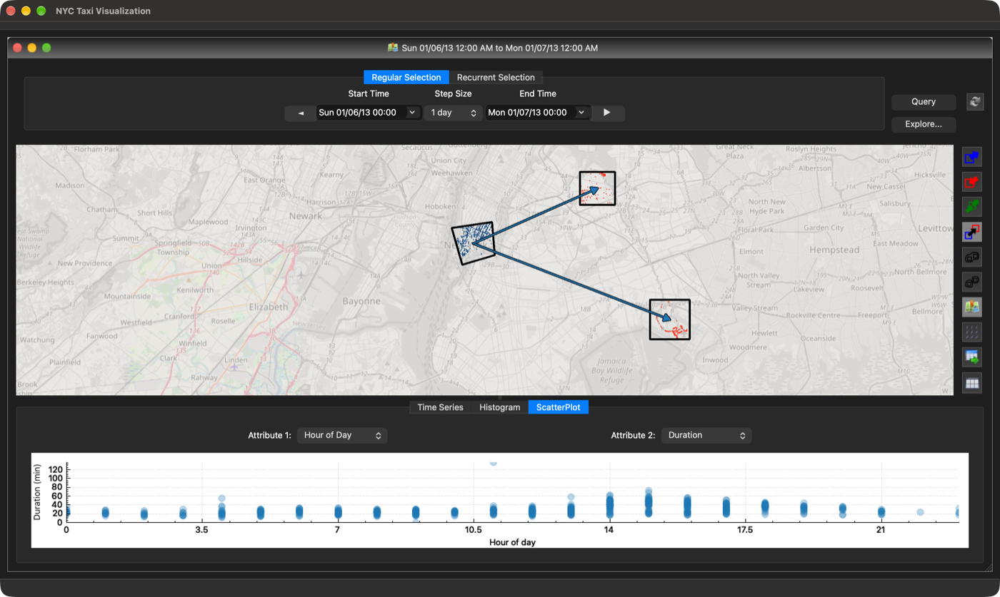

Monday 2013-01-07:

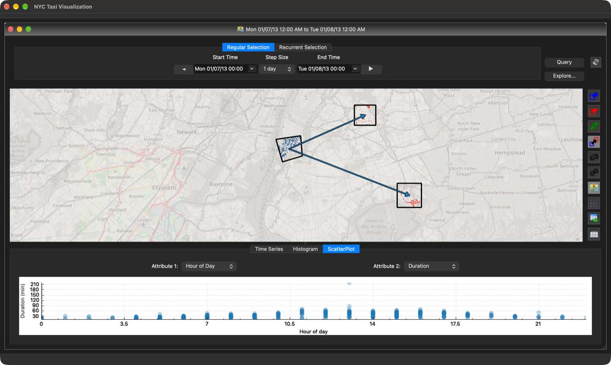

On Sunday the durations stay mostly under 40 minutes all day. On Monday the
2 to 4 PM trips spread up to 60 to 90 minutes, the same weekday afternoon
effect the paper reports for May 2011.

How: zoom to level 11 so both airports are visible, draw the three regions
(pickup type for Lower Manhattan, dropoff type for the airports), choose the
link tool and right-drag from Lower Manhattan to each airport. Set the window
to one day with step 1 day, open the Scatter Plot tab and pick Hour of Day and
Duration. Step forward one day for the second capture. The paper shows the two
days side by side in two synchronized map views (Views → Add Map); here they
are two captures of one view.

## Heat map (paper Fig. 7)

Pickup density for January 1st, drawn by the heat map layer (key 1) at zoom
level 11. The colour bar reads average rides per hour per cell.

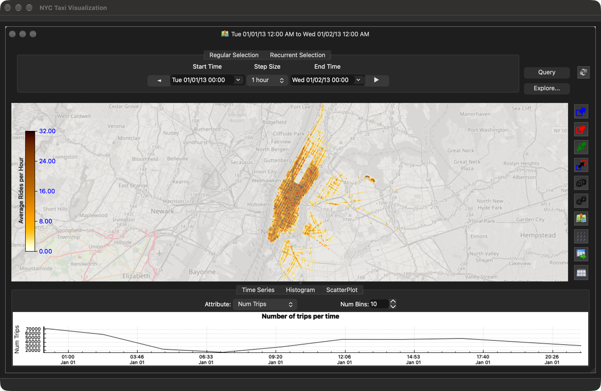

## Time exploration (paper Fig. 11)

The Explore button next to the time controls splits the query window into
steps of the chosen step size and opens a dialog with one heat map per step
and the corresponding curves overlaid in the plots. Here: two one-day steps
starting January 1st, all maps at the main view's position and zoom.

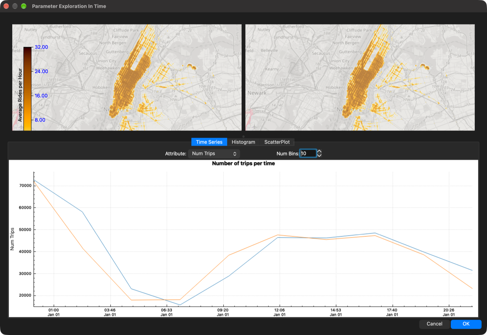

## Attribute exploration

The toolbar's Explore button (bottom of the toolbar) plots every attribute at
once for the current selection. On the Time Series tab it shows one small
time series per attribute; on the Histogram tab, one histogram per attribute.

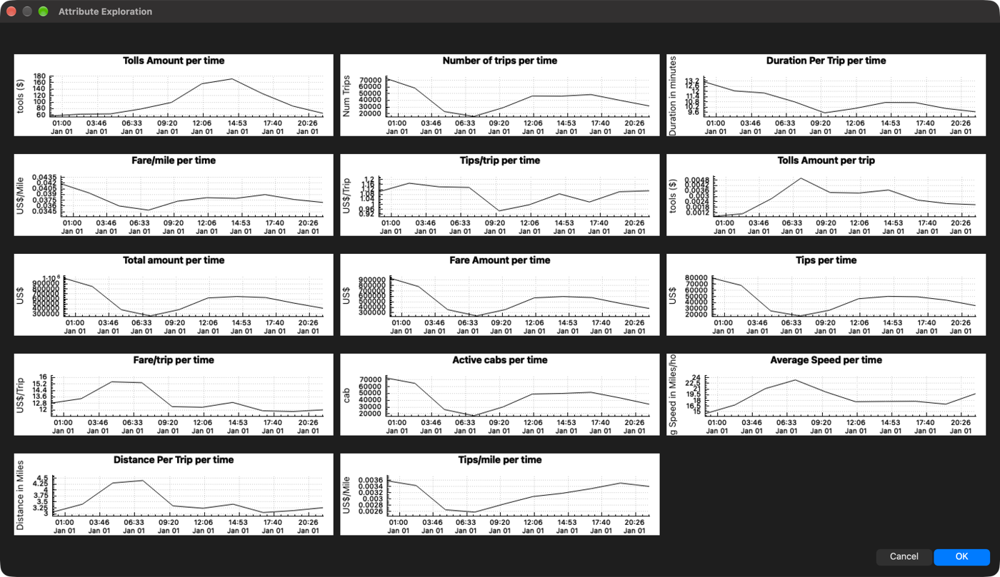

## Link colours

A second link out of the same origin now gets its own colour group, so trips
to the two destinations are separate series in the plots, as in the paper's
Fig. 1. Lower Manhattan to LaGuardia (blue) and to JFK (red):

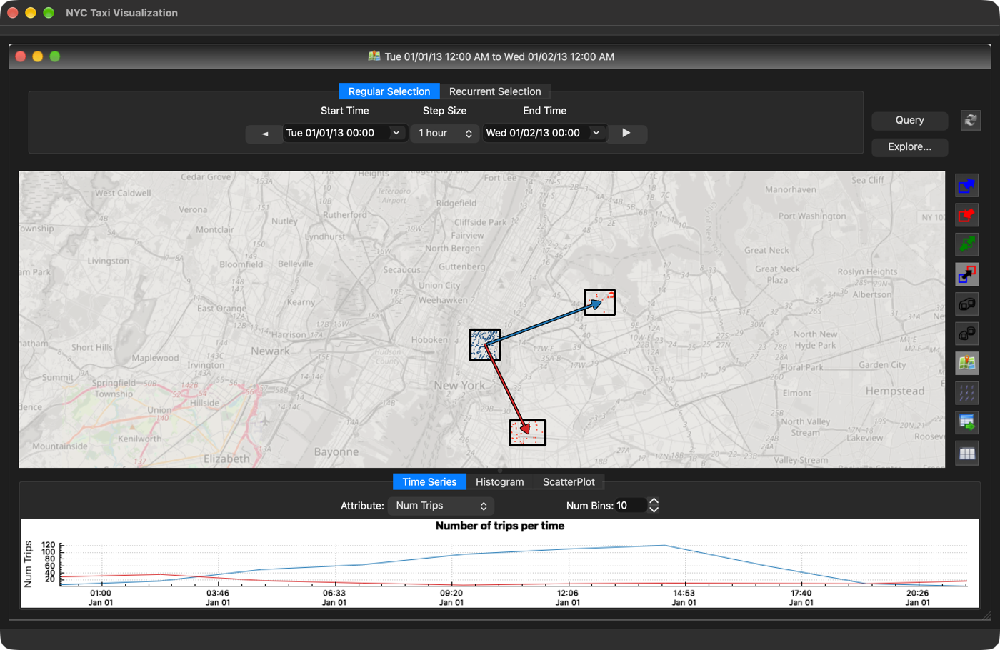

## Not reproduced

- **Grid maps (paper Fig. 12, 13).** Keys 3 and 4 toggle the grid map layers.
  Not tested in this session.
- **Recurrent selection (paper Fig. 5).** Not tried. The tab is present.
