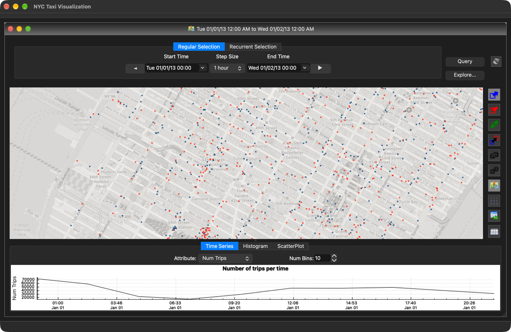
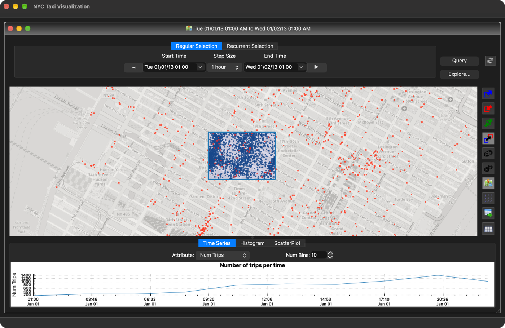
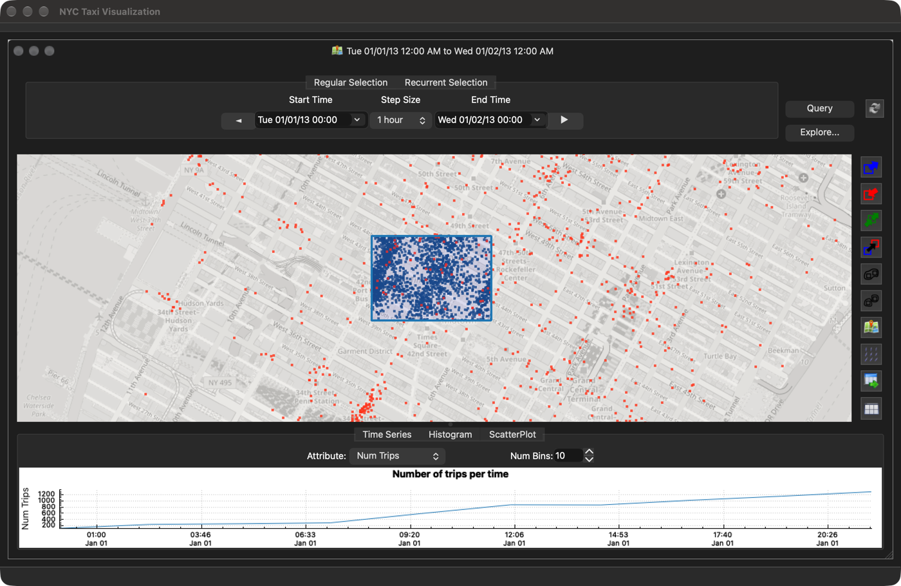
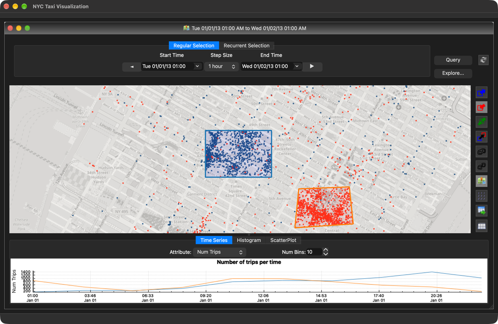
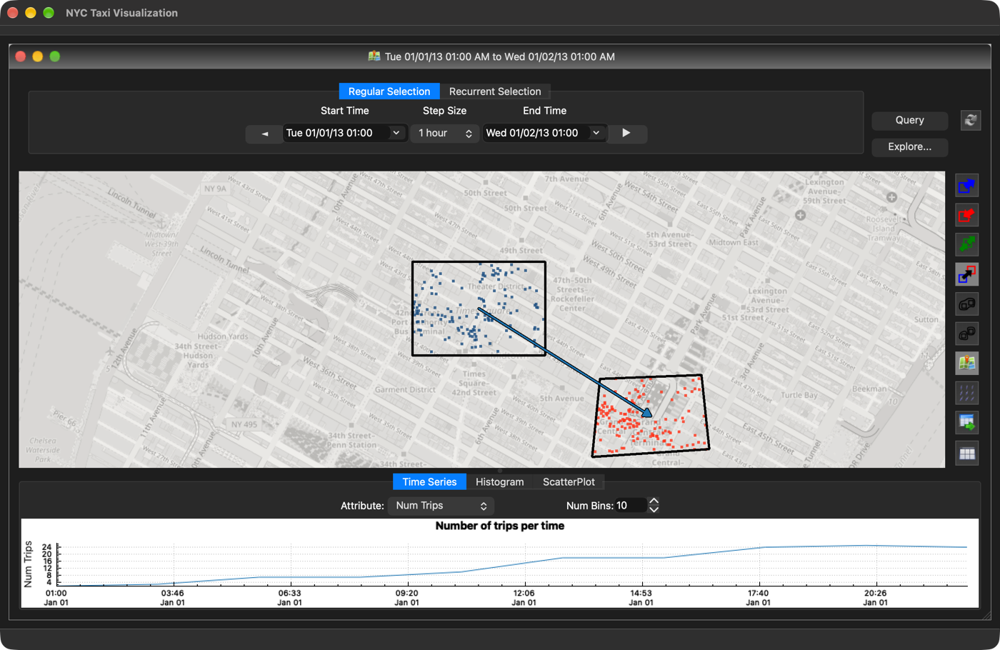
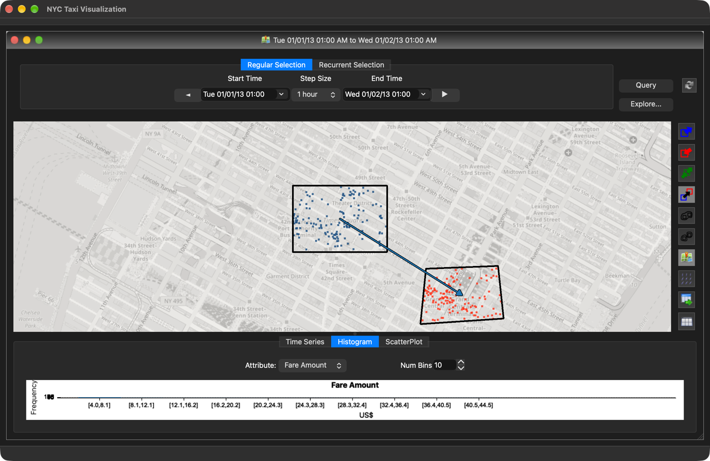
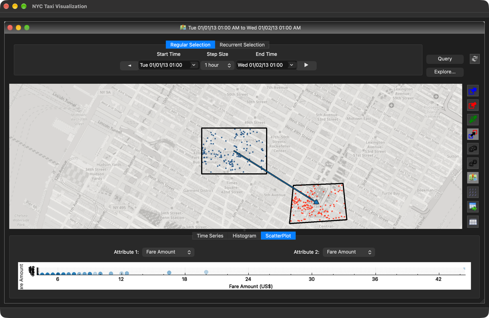
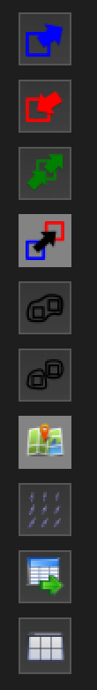

# TaxiVis Usage Guide

This guide walks through the TaxiVis interface using the full January 2013
dataset (14.8 million trips). Screenshots were taken on macOS. Mouse and key
names are given for macOS; on Linux, read Option as Alt and Command as Ctrl.

Right-click is used for all region drawing. On a Mac trackpad that is a
two-finger click, or Control + click.

## 1. Starting the application

Point TaxiVis at a `.kdtrip` file and launch it (see the README for how to
build one from the raw TLC files):

```bash
TAXIVIS_DATA=/path/to/2013_01.kdtrip ./build/src/TaxiVis/TaxiVis
```

The main window opens on Midtown Manhattan showing the first day of the
dataset. Blue dots are pickups, orange dots are dropoffs.



The window has four parts:

- **Time controls** (top): the start time, step size and end time of the
  query window, arrow buttons to step the window, a Query button to re-run
  the query, and an Explore button for the time exploration dialog.
- **Map** (centre): an OpenStreetMap base layer with the query results drawn
  on top. Left-drag pans, the scroll wheel or the + and - keys zoom, and the
  arrow keys pan.
- **Toolbar** (right edge): selection type, linking, merging, layer toggles
  and export. See [Section 8](#8-toolbar-reference).
- **Plots** (bottom): Time Series, Histogram and Scatter Plot tabs showing
  the trips that match the current query.

## 2. Setting the time window

The query window is defined by the Start Time and End Time fields. Edit them
directly, or use the step size and the arrow buttons to move the window by
one step. Every change re-runs the query for all regions on the map.



The step above moved the window from 00:00 to 01:00 on January 1st. The
Left and Right keys do the same while the map has focus. The Recurrent
Selection tab selects the same time span across many days, for example
every weekday morning rush.

## 3. Selecting a region

Before drawing, choose what a region means with the first three toolbar
buttons:

| Button | Meaning |
|---|---|
| Blue arrow into box | Trips that **pick up** inside the region |
| Red arrow out of box | Trips that **drop off** inside the region |
| Green double arrow | Trips that pick up **and** drop off inside the region |

Then draw the region on the map. Three shapes are available:

- **Rectangle**: hold Shift and right-drag.
- **Polygon**: hold Option and right-click to place each vertex. Click on the
  first vertex, or press Escape, to close the polygon.
- **Freehand**: right-drag to trace a lasso. Release to close it.

The query runs when the shape is closed. The screenshot below shows a pickup
rectangle over the Theater District. Only trips that started inside it remain
on the map, and the time series in the bottom panel now plots that
selection.



Regions are independent. Adding a dropoff polygon around Grand Central gives
two colour groups: blue for trips picked up in the rectangle, orange for
trips dropped off in the polygon.



## 4. Linking regions: origin to destination queries

To ask for trips that go **from** one region **to** another, choose the link
tool (fourth toolbar button, black arrow from blue to red box), then
right-drag from the origin region to the destination region. An arrow joins
them and the query is restricted to trips whose pickup is in the first region
and dropoff in the second.


Only the trips that satisfy both ends are drawn: pickups in the origin
box, dropoffs in the destination polygon. Command + click on the arrow removes
the link; the regions stay.

## 5. Editing and removing regions

- **Move**: left-drag the region.
- **Reshape**: Option + left-click the region to show a handle on each
  vertex, then drag the handles. Click outside or press Escape when done.
- **Delete**: Command + left-click the region.
- **Merge / unmerge** (fifth and sixth toolbar buttons): combine all current
  regions into one query group, or split them back into separate groups.

## 6. Reading the plots

All three plots are linked to the map. Each colour group on the map gets its
own series or bars, so linked and independent regions can be compared
directly.

**Time Series** plots an attribute over the query window. With the
origin-to-destination link active it shows the hourly count of trips from
the Theater District to Grand Central on January 1st.



Dragging a range on the time series axis changes the query window.

**Histogram** bins an attribute (fare, distance, duration, tip, and so on)
for the selected trips. Choose the attribute and the number of bins above the
plot.



**Scatter Plot** plots one attribute against another, for example pickup
hour against trip duration.



The Explore button in the time controls runs a time exploration: it splits
the query window into steps of the chosen step size and opens a dialog with
one result per step, so the same regions can be compared hour by hour or day
by day. With more than seven steps it asks for confirmation first.

## 7. Multiple map views

Views → Add Map opens a second map window. Each map has its own regions and
time window. The sync button (circular arrows next to the time controls)
links a map to the others so that panning, zooming and stepping in time are
shared.

## 8. Toolbar reference



From top to bottom:

1. Pickup in region (selection type)
2. Dropoff in region (selection type)
3. Pickup and dropoff in region (selection type)
4. Link two regions (origin to destination)
5. Merge all regions into one group
6. Unmerge regions
7. Show or hide the map tiles
8. Show trip animation for the current selection
9. Export the selected trips to CSV
10. Explore: plot every attribute of the current selection (disabled in the current Qt5 build)

## 9. Keyboard shortcuts

The map must have focus (click it first).

| Key | Action |
|---|---|
| Arrow Left / Right | Step the time window back / forward |
| Arrow keys (with map focus) | Pan the map |
| + / - | Zoom in / out |
| 1 to 9 | Toggle rendering layer 1 to 9 (trip locations, heat map, grid map, animation) |
| Space | Play / pause the trip animation |
| A | Enable / disable the animation layer |
| F5 | Reset the animation |
| L | Toggle level-of-detail rendering for trip locations |
| N | Toggle heat map normalisation |
| E | Export the current selection |
| / | Show / hide the query description overlay |
| . | Show / hide the selection time overlay |
| Escape | Finish a polygon or finish editing a region |

## 10. Notes

- The bundled sample dataset covers essentially one day (2013-01-13), so the
  time series will show a single spike. Use a full month for real exploration.
- Trip animation (toolbar button 8, key A) is disabled on macOS because it
  depends on geometry shaders.
- Times are shown in the machine's local time zone. Data processed with the
  Julia pipeline is interpreted the same way, so wall-clock times match the
  raw CSV files when both steps run in Eastern time.
